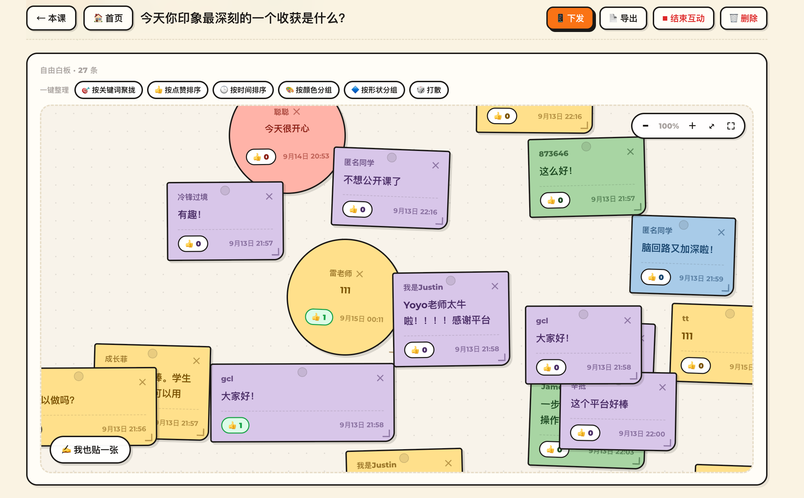

# TeacherYO 课堂互动工具

**TeacherYO** —— AI 培训 / 数字分身 / 角色系统 · [teacheryo.ai](https://teacheryo.ai)

在小红书 / 公众号 / 视频号 / B站 都能找到我们，各平台同名 **TeacherYO**。

微信号：**YoYoQYoYo**

> 让每个人的想法，一起贴上墙。

面向老师的课堂互动套件：便签墙、选择题、填空题、词云、材料学习。
按「课程 = 一学期的一条线性教学流程」组织，一键下发，学生手机扫码即答（免注册），
结果实时汇聚到大屏。



纯前端，零构建 —— 没有 npm、没有打包步骤。HTML + CSS + 原生 JS。

---

## 选一种用法

不需要全看，按你的需求选一条：

| | **本地模式** | **在线版** | **云端协作版** |
|---|---|---|---|
| 要花多久 | 0 分钟 | 约 2 分钟 | 约 15 分钟 |
| 数据存在哪 | 你自己的浏览器 | 你自己的浏览器 | 云数据库 |
| 学生能扫码提交吗 | 同一台电脑开两个标签页可以 | 不能 | **能** |
| 适合场景 | 试用、备课、单机演示 | 随时打开、发给朋友看 | **真实课堂** |
| 要注册账号吗 | 不用 | GitHub | 腾讯云 |

> ⚠️ 注意「在线版」和「云端协作版」的区别：
> **在线版只是把页面放到了网上，数据仍是各自浏览器各存一份**，学生扫码提交你的大屏是看不到的。
> 想真正让学生参与，请用**云端协作版**。

---

## 用法一：本地模式（0 配置，建议先试这个）

```bash
git clone https://github.com/<你的用户名>/teacheryo-whiteboard.git
cd teacheryo-whiteboard
```

然后**双击 `index.html`** —— 就这样，已经可以用了。

右上角会显示橙色的「本地模式」徽标，代表数据存在你这台电脑的浏览器里。
建课程、建互动、贴便签、一键整理……所有功能都能用。

**想体验学生端？** 再开一个浏览器标签页，打开 `student.html`，
选一门互动进去提交，你会发现大屏那一边会自动刷新出来
（两个标签页共享同一份本地数据，正好用来演示完整的课堂流程）。

> 数据存在浏览器里，换个浏览器或清理缓存就没了。
> 重要内容请用互动页的「导出」按钮存一份。

---

## 用法二：部署成在线版（2 分钟）

想随时打开、或者把链接发给朋友看：

1. 点右上角 **Fork**，把仓库复制到你自己的账号下
2. 进入你 Fork 后的仓库 → **Settings** → 左侧 **Pages**
3. Source 选 **Deploy from a branch**，Branch 选 **main**、目录选 **/ (root)**，保存
4. 等 1 分钟，访问 `https://<你的用户名>.github.io/<仓库名>/`

同样地，这个版本仍然是「本地模式」——每个访问者的数据都存在他自己的浏览器里。

---

## 用法三：云端协作版（学生真的能扫码参与）

这一版把数据放到云数据库，学生手机提交的内容会实时出现在你的大屏上。

### 第 1 步：开通 CloudBase

打开 [腾讯云云开发 CloudBase](https://cloud.tencent.com/product/tcb) → 新建环境。
记下**环境 ID**（形如 `teacheryo-xxxx`）。

> 选按量计费，个人课堂的量级基本不产生费用。

### 第 2 步：开启匿名登录

控制台 → 你的环境 → **身份验证** → 登录方式 → 打开 **匿名登录**。
这是学生免注册就能答题的关键。

### 第 3 步：建表

控制台 → **数据库** → SQL 执行，把下面这个文件的内容整段贴进去运行：

```
cloudbase/migrations/20260907005407_init_tables.sql
```

它会建好 `courses` / `boards` / `submissions` 三张表，并配好行级安全策略（RLS）。

### 第 4 步：填配置

在项目根目录新建一个文件 `config.local.js`（这个文件名已在 `.gitignore` 里，不会被提交）：

```js
window.TY_CONFIG = Object.assign(window.TY_CONFIG || {}, {
  envId: '你的环境ID',
  region: 'ap-shanghai',
  accessKey: '你的 Publishable Key'
});
```

`accessKey` 在控制台 → **API 密钥** 里找，填 **Publishable Key**。

> 千万不要填 Secret Key。前端直连数据库，这个文件会随网页一起被下载到，
> 只适合放公开密钥。

### 第 5 步：部署

两种方式任选：

- **CloudBase 静态托管**（推荐，和数据库同域，省事）：
  控制台 → 静态托管 → 上传项目里**除 `.git`、`node_modules` 之外的全部文件**
- **GitHub Pages**：把 `config.local.js` 一起放上去。注意——
  用 GitHub Pages 时，要去 CloudBase 控制台 → **安全配置 → Web 安全域名**，
  把你 Pages 的域名（`https://<用户名>.github.io`）加进白名单，否则请求会被拒绝

部署完成后，手机访问那个域名，右上角应显示「云端同步」。

---

## 老师怎么用

1. **建课程**：首页「＋ 新建课程」。一门课 = 一学期的一条流程，所有互动都沉淀在里面
2. **加互动**：进课程 → 添加互动，选便签墙 / 选择题 / 填空题 / 词云 / 材料学习
3. **下发**：进互动页 → 点「下发二维码」，学生扫码或点链接进
4. **看结果**：学生提交的内容实时汇聚到大屏，可点赞、可拖动、可一键整理
5. **导出**：导出成文本存档

**便签墙的几个细节**

- 它是一块**无限白板**：滚轮/双指缩放，空白处拖动平移，内容可以放到任意位置
- 便签可拖动、可拉右下角调大小、可换颜色和形状（方形/圆形/胶囊/标签）
- 「一键整理」支持按关键词聚拢、按点赞排序、按时间排序、按颜色分组、按形状分组、打散
- 老师贴的便签会带**金边 + 老师头像**，学生一眼能认出来
- 点右上角 ⤢ 进入**全屏沉浸**，只剩白板内容，按 Esc 退出

## 学生怎么用

扫码或点链接打开 → 输入昵称 → 作答 → 提交。
免注册、免下载 App，提交后老师的屏幕立刻更新。

---

## 目录结构

```
teacheryo-whiteboard/
├── index.html            老师端
├── student.html          学生端
├── AI-PROMPT.md          给 AI 助手看的说明（含可直接复制的话术）
├── config.js             配置模板（保持为空就是本地模式）
├── config.local.js       你的私有配置 —— 不进 Git（需自己创建）
├── css/style.css         全部样式
├── js/
│   ├── common.js         公共组件：无限画布、便签渲染、一键整理
│   ├── db.js             数据层入口：自动判断用「本地」还是「云端」
│   └── store.local.js    本地模式的存储实现（浏览器 localStorage）
├── vendor/
│   └── cloudbase.full.js 腾讯云开发 Web SDK（已本地化，无需联网下载）
├── cloudbase/
│   └── migrations/       建表 SQL
├── docs/                 README 用图
└── LICENSE
```

**它是怎么自动切换的**：`js/db.js` 启动时检查 `config.js` / `config.local.js` 里的 `envId`。
留空 → 挂载 `store.local.js`（本地模式）；填了值 → 连 CloudBase（云端模式）。
两种模式暴露出完全一样的数据接口，所以页面代码一行都不用改。

---

## 常见问题

**打开页面是白屏 / 没反应？**
用浏览器直接双击打开时，某些浏览器会限制本地文件读取。换成 `python3 -m http.server`
起个本地服务，或者直接走用法二部署到网上。

**控制台提示 `config.local.js` 404？**
正常 —— 说明你还没有私有配置，当前是本地模式。不影响使用。

**我想清空本地数据？**
浏览器控制台执行 `localStorage.removeItem('ty.local.v1')` 然后刷新。

**想备份本地数据？**
控制台执行 `copy(TY.local.exportJSON())` 可复制成 JSON；恢复用 `TY.local.importJSON(文本)`。

**学生扫码打不开？**
本地模式和学生自己的手机之间不共享数据，必须部署到网上（用法三）。
另外二维码指向的域名必须手机能访问。

---

## 安全说明（重要）

这是「前端直连数据库」的架构 —— 页面代码和配置文件都会被访问者下载到，
`envId` 和 `Publishable Key` 天生是公开的。这不是配置失误，而是这类无后端应用的固有特性。

因此请务必做到：

1. **每人用自己申请的环境**，不要共用别人的 `envId`
2. `accessKey` 只填 **Publishable Key**，绝不用 Secret Key
3. 上线前**收紧数据库权限**。仓库里附带的 SQL 是课堂场景的宽松版
   （学生要能匿名写入自己的提交），至少应确认：
   - 不给 `anon` 开放删除/修改他人记录的权限
   - 或者引入云函数 / 自定义登录来区分老师和学生角色
4. 公开仓库里不要提交 `config.local.js`

---

## 许可

[MIT](LICENSE) —— 随便用、随便改、随便分发，包括商用。
唯一的要求是保留版权声明，且作者不对使用后果负责。

如果这套东西帮到了你，欢迎告诉身边也在折腾课堂互动的老师。
